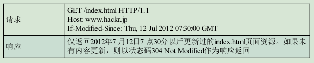
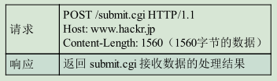
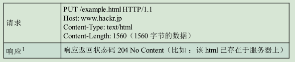
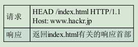
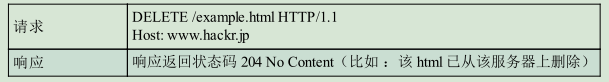
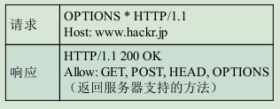
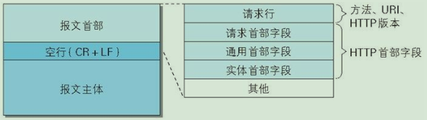
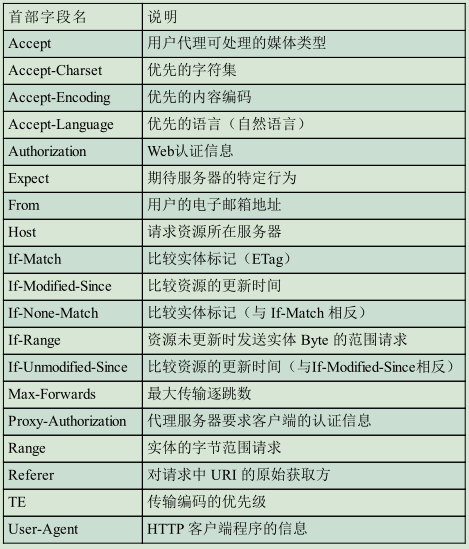
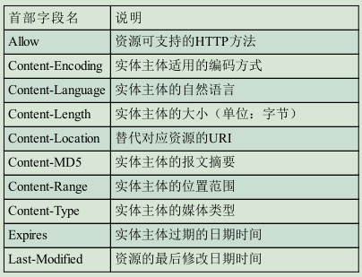
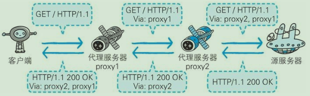

### HTTP：HyperText Transfer Protocol，超文本传输协议 。
### HTTP 是一种不保存状态，即无状态（stateless）协议。HTTP 协议自身不对请求和响应之间的通信状态进行保存。
```
    为了实现期望的保持状态功能，于是引入了Cookie 技术。
    有了 Cookie 再用 HTTP 协议通信，就可以管理状态了。
```
### HTTP 方法
- GET ：获取资源

- POST：传输实体主体

- PUT：传输文件（鉴于 HTTP/1.1 的 PUT 方法自身不带验证机制，任何人都可以上传文件 , 存在安全性问题，因此一般的 Web 网站不使用该方法）

- HEAD：获得报文首部（HEAD 方法和 GET 方法一样，只是不返回报文主体部分。用于确认URI 的有效性及资源更新的日期时间等。）

- DELETE：删除文件（HTTP/1.1 的 DELETE 方法本身和 PUT 方法一样不带验证机制，所以一般的 Web 网站也不使用 DELETE 方法。）

- OPTIONS：用来查询针对请求 URI 指定的资源支持的方法。

- TRACE： 是让 Web 服务器端将之前的请求通信环回给客户端的方法。
- CONNECT 要求在与代理服务器通信时建立隧道，实现用隧道协议进行 TCP 通信。（主要使用 SSL（Secure Sockets Layer，安全套接层）和 TLS（Transport Layer Security，传输层安全）协议把通信内容加密后经网络隧道传输。）

### Cookie
```
    Cookie 的作用是通过在请求、响应报文中写入 Cookie 信息来控制客户端的状态。
    在服务器端发送响应报文时通过手部字段 Set-Cookie，通知客户端保存Cookie。
    客户端向服务器端发送请求时会在请求报文中加入Cookie。
    服务器端收到Cookie时会对比服务器上的记录，最后得到之前的状态信息。
```
### HTTP报文
- 请求报文：请求端（客户端）的HTTP 报文。

- 响应报文：响应端（服务器端）的HTTP 报文。

- 请求报文和响应报文的首部内容由以下数据组成。
```
    1、请求行-包含用于请求的方法，请求 URI 和 HTTP 版本。
    2、状态行-包含表明响应结果的状态码，原因短语和 HTTP 版本
    3、首部字段-包含表示请求和响应的各种条件和属性的各类首部。
```

### 四种首部字段类型
- 通用首部字段：请求报文和响应报文两方都会使用的首部。

- 请求首部字段：从客户端向服务器端发送请求报文时使用的首部。

- 响应首部字段：从服务器端向客户端返回响应报文时使用的首部。

- 实体首部字段：针对请求报文和响应报文的实体部分使用的首部



### 常用内容编码
- gzip（GNU zip）
- compress（UNIX 系统的标准压缩）
- deflate（zlib）
- identity（不进行编码）

### HTTP状态码

- 2XX
```
    1、200 OK    表示从客户端发来的请求在服务器端被正常处理了。
    2、204 No Content    该状态码代表服务器接收的请求已成功处理，但在返回的响应报文中不含实体的主体部分，也不允许返回任何实体的主体。
    3、206 Partial Content   该状态码表示客户端进行了范围请求，而服务器成功执行了这部分的GET 请求。响应报文中包含由 Content-Range 指定范围的实体内容 
```
- 3XX
```
    1、301 Moved Permanently    永久性重定向。该状态码表示请求的资源已被分配了新的 URI，以后应使用资源现在所指的 URI。
    2、302 Found   临时性重定向。该状态码表示请求的资源已被分配了新的 URI，希望用户（本次）能使用新的 URI 访问。
    3、303 See Other    该状态码表示由于请求对应的资源存在着另一个 URI，应使用 GET方法定向获取请求的资源。
    4、304 Not Modified    该状态码表示客户端发送附带条件的请求（ GET 方法的请求报文中包含 If-Match，If-Modified-Since，If-None-Match，If-Range，If-Unmodified-Since 中任一首部。） 时，服务器端允许请求访问资源，但未满足条件的情况。即缓存文件仍未过时，可以使用缓存文件
    5、307 Temporary Redirect    临时重定向。该状态码与 302 Found 有着相同的含义。
```
**注意： 303 状态码和 302 Found 状态码有着相同的功能，303 状态码明确表示客户端应当采用 GET 方法获取资源，这点与 302 状态码有区别。**

- 4XX
```
    1、400 Bad Request    该状态码表示请求报文中存在语法错误。 
    2、401 Unauthorized    该状态码表示发送的请求需要有通过 HTTP 认证（BASIC 认证、DIGEST 认证）的认证信息。另外若之前已进行过 1 次请求，则表示用户认证失败。
    3、403 Forbidden    该状态码表明对请求资源的访问被服务器拒绝了。
    4、404 Not Found    该状态码表明服务器上无法找到请求的资源。
```

- 5XX
```
    1、500 Internal Server Error    该状态码表明服务器端在执行请求时发生了错误。
    2、503 Service Unavailable    该状态码表明服务器暂时处于超负载或正在进行停机维护，现在无法处理请求。
```

### 通信数据转发程序
- 代理：代理是一种有转发功能的应用程序。代理服务器的基本行为就是接收客户端发送的请求后转发给其他服务器。代理不改变请求 URI，会直接发送给前方持有资源的目标服务器。
```
    代理的的作用：
        1、利用缓存技术减少网络带宽的流量
        2、组织内部针对特定网站的访问控制
        3、以获取访问日志为主要目的
    代理的分类：
        1、缓存代理：代理转发响应时，缓存代理（Caching Proxy）会预先将资源的副本（缓存）保存在代理服务器上。
        2、透明代理：转发请求或响应时，不对报文做任何加工的代理类型被称为透明代理
```


- 网关：网关是转发其他服务器通信数据的服务器。
```
    网关能使通信线路上的服务器提供非 HTTP 协议服务。
```


- 隧道：隧道是在相隔甚远的客户端和服务器两者之间进行中转，并保持双方通信连接的应用程序。

```
    隧道可按要求建立起一条与其他服务器的通信线路，届时使用 SSL 等加密手段进行通信。
    隧道的目的是确保客户端能与服务器进行安全的通信。
    隧道本身不会去解析 HTTP 请求。
```


